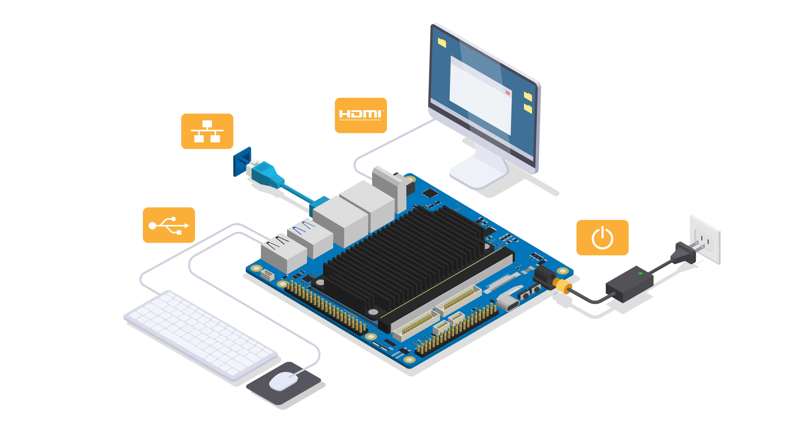

# Quick Start Instructions  

By default your kit comes pre-installed with canonical Ubuntu and Intel Edge Insights for Vision SW. Your device will, after powering up, boot directly into the ubuntu desktop. For user guidance on Intel Edge Insights please refer to the two hyperlinks below.

​		- Linux getting started guide [click here](https://www.intel.com/content/www/us/en/develop/documentation/edge-insights-vision-doc/get-started-guide-using-linux/linux-tutorials/single-and-multi-object-detection-hw-accel.html)

​		- Windows getting started guide [click here](https://www.intel.com/content/www/us/en/develop/documentation/edge-insights-vision-doc/get-started-guide-using-windows/windows-tutorials/single-and-multi-object-detection-windows.html)

In circumstances one wants to change the pre-installed OS follow below guidelines to get your system up and running

* Download the OS of your choice (Yocto/Ubuntu/Windows/Android) from our downloads page into your host computer [click here](https://www.ipi.wiki/pages/ipi-smarc-elkhart-lake-downloads).

* Insert the empty USB drive in to your host computer and flash the downloaded OS to USB to make a [bootable USB drive](PreparingabootableUSBdrive.html).

* Connect the power cable, mouse, keyboard, HDMI cable and LAN cable to the target board.
	
* Plug the bootable USB drive to the target and power on. Enter boot menu by continuous clicking on ESC button.

* After entering into boot manager, select the USB drive from boot options to boot from it. [Click here](biossettings.html) to enable the BIOS settings.

* After successful booting, the desktop screen should be visible on the connected HDMI display.

