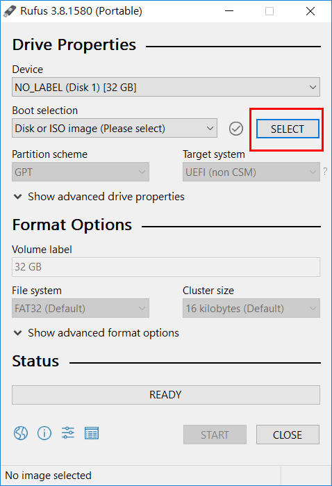
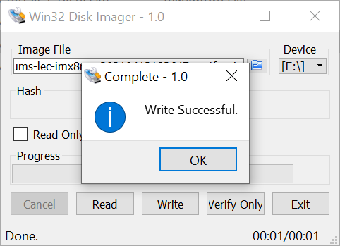

# Preparing a bootable USB drive 

This procedure describes how to Flash the OS into USB drive and make it as an installation medium
<div class="bullets">

## Prerequisites

- Download the prebuilt bootable image to the working directory on your development host  [click here (20211227 build)](https://cdimage.ubuntu.com/focal/daily-live/current/focal-desktop-amd64+intel-iot.iso). 
- In Windows environments, please download [Rufus](https://rufus.ie/) / [Win32DiskImager](https://win32diskimager.download/) to flash the image to the USB drive. (Rufus is flashing tool for **.iso** format and Win32DiskImager is flashing tool for **.wic** format)
- In a Linux environment use `dd` command.

**Note:** All files will be erased on the USB drive. The size should be preferable 16 GB or larger.


### Windows Host

#### Rufus as Flashing tool

1. Insert an empty USB card into the development host and execute rufus.exe as the picture below. It will auto-detected your storage drives.

2. Press the **SELECT** button and browse to the .iso file previously downloaded to your working directory on the development host. Then click **START** and wait for the process to be finished.

   




#### Win32DiskImager as Flashing tool

Insert an empty USB drive into the development host and execute the Win32DiskImager tool.

- The USB device is automatically detected.

- Choose Image (.wic) file by clicking on File explorer icon.

- Select the image form the downloaded directory of host computer, then click the **Write** button to start the process.




### Linux Host

1. Download the prebuilt bootable OS to the working directory on your development host. Insert an empty USB drive and enter the following command to flash the OS to the USB drive.

   **Warning**: Make sure you first properly identify the USB device, for example (/dev/sdb or /dev/sdc) by using “gparted”. Data loss may result if written into the wrong device or in the worst case you kill your hosts OS.

   ```
   $ sudo dd if=[your image].img of=/dev/sd[x]
   ```

   After dd has completed, enter the following command:

```
$ sync
```

**Note**: You can also flash Yocto and Android images using Linux host, but make sure, you type the correct image format in your `dd` command.

</div>