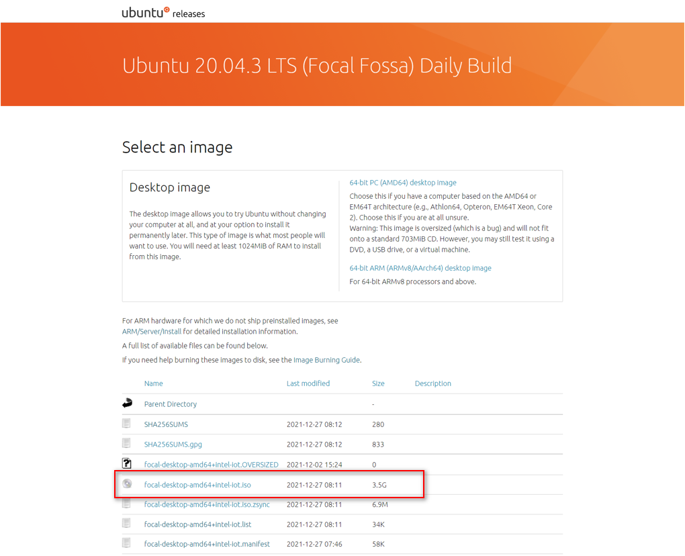
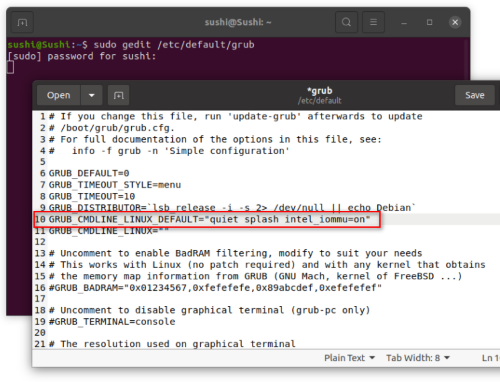

<div class= "bullets">
​    


# Ubuntu Focal Fossa 20.04.3 LTS (with Intel Elkhart Lake)

it will guide you through the steps to install Ubuntu Desktop on your system.


  Current limitations:

   - unable to enable for two Ethernet ports. ( Canonical suggest an workaround solution and [click here](UbuntuImages.html#How-to-enable-two-Ethernet-Ports) )

   - pinctrl driver can not work to control GPIO pins (waiting for Canonical solution)

     

<br>

## Download an Ubuntu Image

you can download an Ubuntu image [here](https://cdimage.ubuntu.com/focal/daily-live/current/). (**Make sure to select the correct one**: ***focal-desktop-amd64+intel-iot.iso***)





## Create a Bootable USB stick

To install Ubuntu Desktop, you need to write your downloaded ISO to a USB stick to create the installation media. you'll use rufus to download and Install tool: [click here](https://docs.ipi.wiki/SMARC/ipi-smarc-elkhart-lake/PreparingabootableUSBdrive.html) to see the steps.


##  Boot from USB flash drive

Insert the USB flash drive into the IPi SMARC Elkhart Lake and boot or restart the device. It should recognize the installation media automatically. If not, try holding **F10** during startup and selecting the USB device from the system-specific boot menu. also go [here](https://docs.ipi.wiki/SMARC/ipi-smarc-elkhart-lake/biossettings.html) to see how to boot from USB drive 

You should now see the welcome screen inviting you to either try or install Ubuntu.


### Installation Setup

Next, you will be prompted to choose the settings you need and follow up the installation guideline until it is complete.

.png)


## How to enable two Ethernet Ports

it is a workaround solution to modify grub file to enable two Ethernet functions.(Intel & Canonical is working to fix it)

Here is the steps:

1.  First edit the configuration file via command:

   ```
   sudo gedit /etc/default/grub
   ```

   When it opens, add **"intel_iommu=on "** into the line of **GRUB_CMDLINE_LINUX_DEFAULT** and finally save the file.

   


2. Update grub to apply the configuration changes and then reboot.

   ```
   sudo update-grub
   ```


</div>