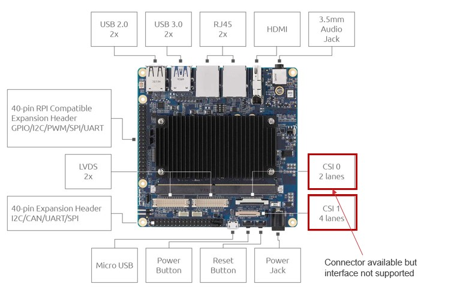
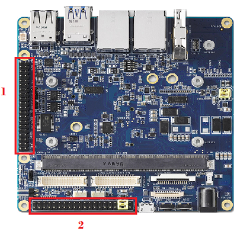
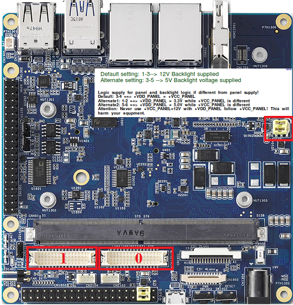
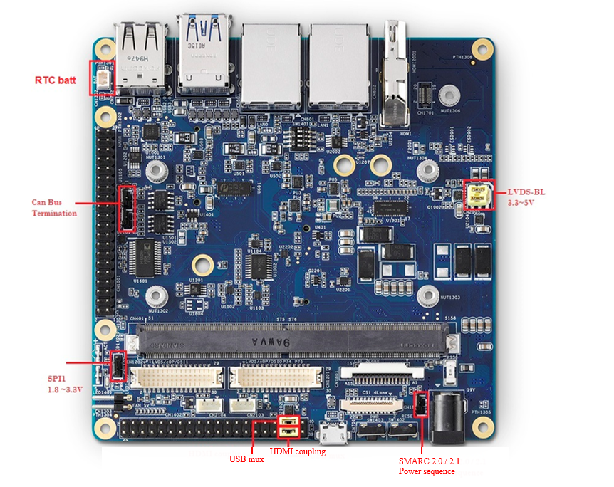

#  I-Pi SMARC with Intel 6th Gen. Atom x6425E SoC 

### 40-Pin Expansion Headers:

 

## 40-Pin RPI Compatible Expansion Header (1)

| Function     | MRAA   Number | MRAA  number | Function |
| ------------ | :------------ | ------------ | -------- |
| 3.3V         | 1             | 2            | 5V       |
| I2C 1 SDA    | 3             | 4            | 5V       |
| I2C 1SCL     | 5             | 6            | GND      |
| GPIO 4       | 7             | 8            | UART TXD |
| GND          | 9             | 10           | UART RXD |
| GPIO 17      | 11            | 12           | GPIO 18  |
| GPIO 27      | 13            | 14           | GND      |
| GPIO 22      | 15            | 16           | GPIO 23  |
| 3.3V         | 17            | 18           | GPIO 24  |
| GPIO 10/MOSI | 19            | 20           | Ground   |
| GPIO 9/MISO  | 21            | 22           | GPIO 25  |
| GPIO 11/SCLK | 23            | 24           | GPIO 8   |
| GND          | 25            | 26           | GPIO 7   |
| DNC          | 27            | 28           | DNC      |
| GPIO 5       | 29            | 30           | GND      |
| GPIO 6       | 31            | 32           | GPIO 12  |
| GPIO 13      | 33            | 34           | GND      |
| GPIO 19      | 35            | 36           | GPIO 16  |
| GPIO 26      | 37            | 38           | GPIO 20  |
| GND          | 39            | 40           | GPIO 21  |

## 40-Pin Expansion Header(2)

| Function       | Pin Number | Pin number | Function      |
| -------------- | ---------- | ---------- | ------------- |
| SER 1 RX       | 1          | 2          | SER3 RX       |
| SER 1 TX       | 3          | 4          | SER3 TX       |
| GND            | 5          | 6          | GND           |
| SER 2 RX       | 7          | 8          | SER2RTS#      |
| SER 2 TX       | 9          | 10         | SER2 CTS#     |
| GND            | 11         | 12         | GND           |
| CANO_H         | 13         | 14         | CAN1_H        |
| CANO_L         | 15         | 16         | CAN1_L        |
| GND            | 17         | 18         | GND           |
| NC             | 19         | 20         | NC            |
| SPI1_HOLD_N    | 21         | 22         | SPI1_WP_N     |
| GND SPI1_CS0_N | 23         | 24         | SPI1_CS1_N    |
| GND            | 25         | 26         | VCC_SPI1      |
| SPI1_CLK       | 27         | 28         | GND           |
| SPI1_IO0_MOSI  | 29         | 30         | SPI1_IO1_MISO |
| SPI1_IO3       | 31         | 32         | SPI1_IO2      |
| ESPI_ALERT_0#  | 33         | 34         | ESPI_ALERT_1# |
| ESPI_RESET_N   | 35         | 36         | GND           |
| NC             | 37         | 38         | NC            |
| NC             | 39         | 40         | NC            |

### Connector Pinout and Signal Descriptions

 

## LVDS Pin Header 0

| Function           | Pin Number | Pin Number | Function                |
| ------------------ | ---------- | ---------- | ----------------------- |
| PNLPWR             | 2          | 1          | LVDS0_EDP0_DSI0_D0_CN_P |
| .+VDD_PANEL0_EDID  | 4          | 3          | LVDS0_EDP0_DSI0_D0_CN_N |
| .+VDD_PANEL0_EDID  | 6          | 5          | GND                     |
| .+VDD_PANEL0       | 8          | 7          | LVDS0_EDP0_DSI0_D1_CN_P |
| .+VDD_PANEL0       | 10         | 9          | LVDS0_EDP0_DSI0_D1_CN_N |
| GND                | 12         | 11         | GND                     |
| LVDS_BLKT0_CTRL    | 14         | 13         | LVDS0_EDP0_DSI0_D2_CN_P |
| LVDS_BLKT0_EN      | 16         | 15         | LVDS0_EDP0_DSI0_D2_CN_N |
| GND                | 18         | 17         | GND                     |
| LVDS_BLKT0_EN      | 20         | 19         | LVDS0_EDP0_DSI0_D3_CN_P |
| LCD0_VDD_EN_3V3    | 22         | 21         | LVDS0_EDP0_DSI0_D3_CN_N |
| eDP_HPD_DSI0_TE_3V | 24         | 23         | GND                     |
| DDC0_DAT           | 26         | 25         | LVDS0_EDP0_DSI0_CK_CN_P |
| DDC0_CK            | 28         | 27         | LVDS0_EDP0_DSI0_CK_CN_N |
| GND                | 30         | 29         | GND                     |

## LVDS Pin Header 1

| Function           | Pin Number | Pin Number | Function                |
| ------------------ | ---------- | ---------- | ----------------------- |
| PNLPWR             | 2          | 1          | LVDS1_EDP1_DSI1_D0_CN_P |
| .+VDD_PANEL1_EDID  | 4          | 3          | LVDS1_EDP1_DSI1_D0_CN_N |
| .+VDD_PANEL1_EDID  | 6          | 5          | GND                     |
| .+VDD_PANEL1       | 8          | 7          | LVDS1_EDP1_DSI1_D1_CN_P |
| .+VDD_PANEL1       | 10         | 9          | LVDS1_EDP1_DSI1_D1_CN_N |
| GND                | 12         | 11         | GND                     |
| LVDS_BLKT1_CTRL    | 14         | 13         | LVDS1_EDP1_DSI1_D2_CN_P |
| LVDS_BLKT1_EN      | 16         | 15         | LVDS1_EDP1_DSI1_D2_CN_N |
| GND                | 18         | 17         | GND                     |
| LVDS_BLKT1_EN      | 20         | 19         | LVDS1_EDP1_DSI1_D3_CN_P |
| LCD1_VDD_EN_3V3    | 22         | 21         | LVDS1_EDP1_DSI1_D3_CN_N |
| eDP_HPD_DSI1_TE_3V | 24         | 23         | GND                     |
| DDC1_DAT           | 26         | 25         | LVDS1_EDP1_DSI1_CK_CN_P |
| DDC1_CK            | 28         | 27         | LVDS1_EDP1_DSI1_CK_CN_N |
| GND                | 30         | 29         | GND                     |

### Jumper Settings

 

| Interface          | Setting |
| ------------------ | ---------- |
| Can Bus             | on = Terminated 120 Ohm          |
| LVDS Backlight | 1 ~ 3 = 5V \| 3 ~ 5 = 3,3V    |
| SPI1 Voltage | 1 ~ 2  1,8V  \| 2 ~ 3 3,3V |
| USB Mux     | 36 ~ 38 = M.2  \| 38 ~ 40 = USB |
| HDMI Coupling      | 35~37 = AC  \| 37 ~ 39 = DC |
| SMARC Power Seq              | ON = 2,1  \| OFF = 2,0    |

