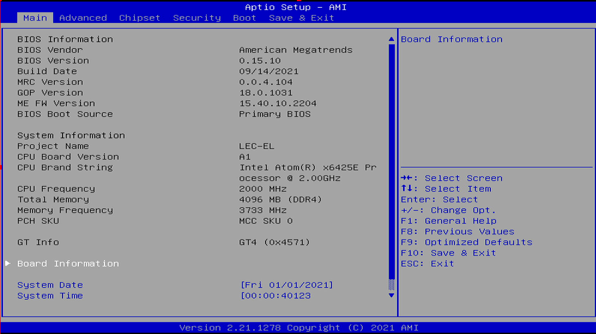
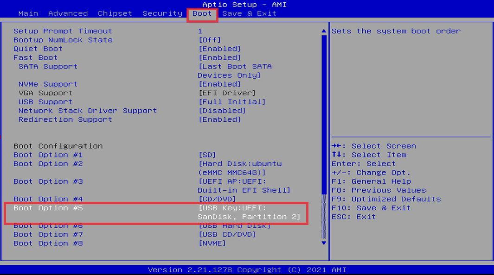
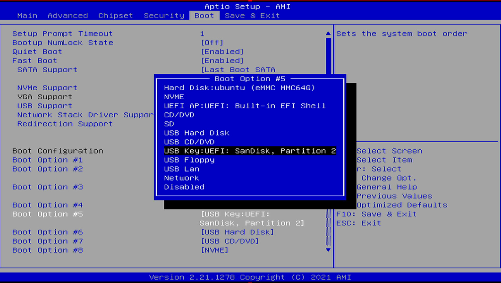
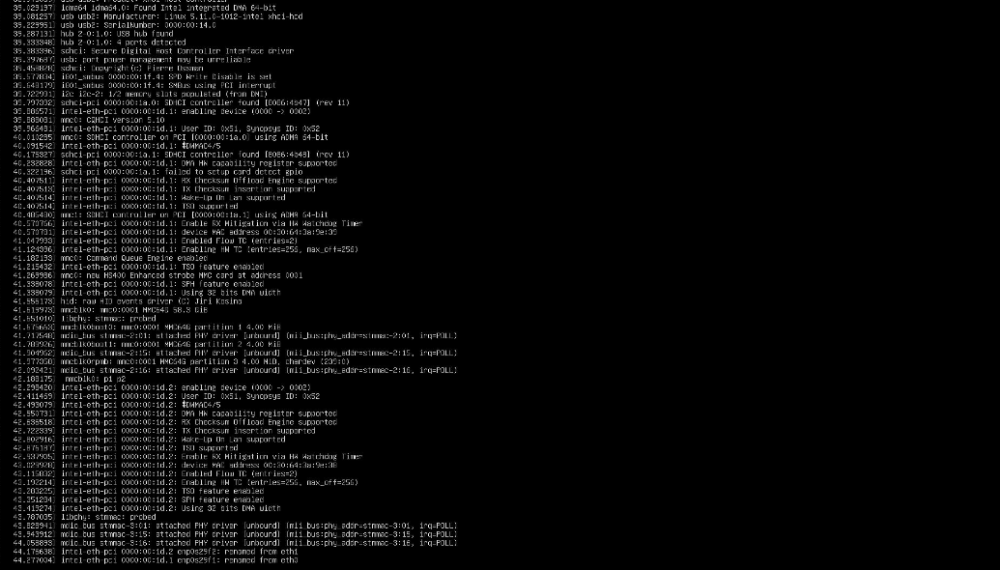
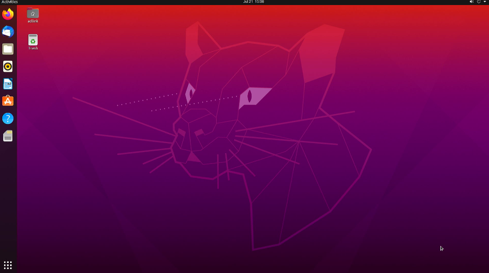

# BIOS Settings

This procedure describes about enabling USB boot in BIOS settings

## Steps

1. Make sure your [USB drive is bootable](PreparingabootableUSBdrive.html)

2. Insert USB drive into the target board and Power on

3. You will enter BIOS settings by continuous clicking on ESC button

   

4. Navigate to Boot tab to view the boot configuration and Choose your USB device as boot option

   

5. Press F10 key to save and exit from BIOS settings, you will notice the target board starts booting, which might take few minutes

   

6. After booting finishes, you will see the home screen, the below Image shows the home screen of Ubuntu OS for an example

   

